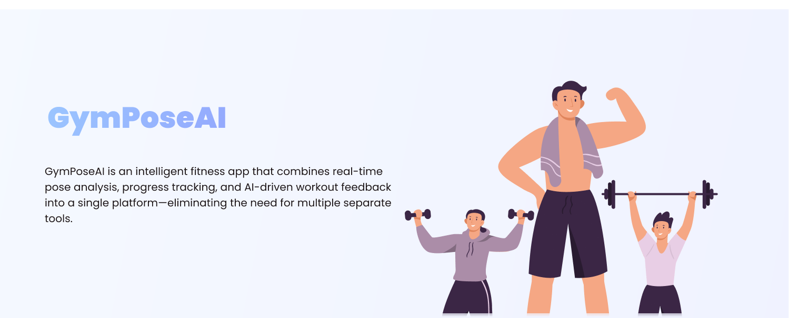
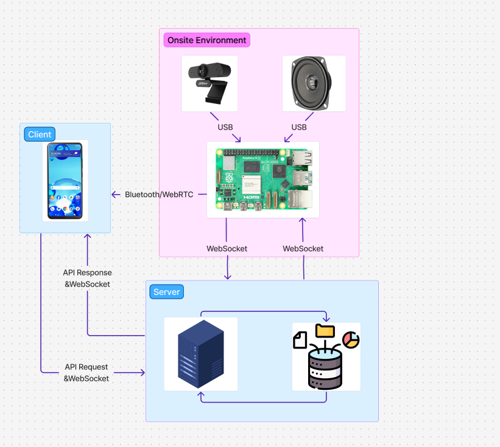

# GymPoseAI – Smart AI-Powered Training App

## 🎥 Demo Video

[Video](https://drive.google.com/file/d/1-qCqmhA6iKZpND-px9li-EyB5snpeZUz/view?usp=drive_link)

## 🏋️ Introduction

**GymPoseAI** is a smart at-home fitness application designed to enhance your workout effectiveness using artificial intelligence (AI). The app is compatible with both **iOS** and **Android** devices and analyzes user posture via camera, offering real-time feedback.

> 📌 The goal of this project is to provide a platform that helps users train with proper form, easily track their progress, and achieve optimal results from home.

> 📷 **Note**: The camera system is a **dedicated external hardware setup**, consisting of a **Raspberry Pi 4** and **a speaker** that functions as the primary image capturing and real-time voice feedback unit.

---

## 🚀 Key Features

### 🤖 AI Training Assistant

-   Posture analysis using camera (AI pose estimation).
-   Detects incorrect form and provides instant feedback.
-   Provides session performance evaluations.

### 📊 Workout History

-   Stores detailed information: time, exercise type, repetitions, and quality assessment.
-   Helps monitor training progress.

### 📈 Data Visualization

-   Progress charts by **week/month/year**.
-   Helps users evaluate effectiveness and stay motivated.

### 🎯 Goal Tracking

-   Set daily water intake and calorie burn targets.
-   Get reminders and monitor goal completion.

### 🔐 Authentication

-   Integrates **OAuth 2.0**, allowing fast and secure login via Facebook.

### 🔔 Push Notifications

-   Mobile app supports **push notifications** using **Firebase Cloud Messaging (FCM)** for workout reminders, pending goals, and technical alerts.

---

## ⚙️ Architecture & Technologies

### 🤖 AI System

| Component              | Details                                                                                   |
|------------------------|-------------------------------------------------------------------------------------------|
| Language               | Python 3.10                                                                               |
| Libraries              | NumPy 1.21, PyTorch 1.12, Scikit-learn 1.0, Matplotlib 3.5, Mediapipe 0.8                 |
| Model Architecture     | Bi-directional GRU (Bi-GRU) + Attention layer                                             |
| Input Format           | 2D Tensor (T x F) – T: time frames, F: features (joint keypoints)                         |
| Output Classes         | 6 squat posture labels (Correct, Narrow feet, Wide feet, Knee in, Too deep, Back bending) |
| Optimization           | Grid Search (layers, size, dropout, learning rate), class weighting                       |
| Data Augmentation      | Time warping, Jittering                                                                   |
| Training Strategy      | 9-fold Cross-Validation + Fixed test subject (1 person = 10%)                             |
| Hardware               | NVIDIA GPU (training ~3 hours for 1000 epochs)                                            |
| Accuracy               | 94% on detecting "Toes Lifting" error with GRU + Attention                                |

### 🔌 Hardware

| Device            | Raspberry Pi 4                                                          |
|-------------------|-------------------------------------------------------------------------|
| Peripherals       | USB Camera, Speaker (loa)                                               |
| Pose Detection    | MediaPipe Pose (on-device processing)                                   |
| Communication     | WebSocket (streaming keypoints to backend server)                       |
| Speech Output     | Google Text-to-Speech (TTS) → Output via speaker                        |
| Use Case          | Capture human poses → extract keypoints → stream to backend in realtime |

### 📱 Mobile App

| Component         | Details                     |
| ----------------- | --------------------------- |
| Language          | JavaScript/TypeScript       |
| Framework         | React Native (Expo)         |
| State Management  | React Context + React Query |
| Local Storage     | AsyncStorage                |
| API Communication | Axios, WebSocket            |
| Video Streaming   | WebRTC                      |
| Push Notification | Firebase Cloud Messaging    |
| Deployment        | Google Play & App Store     |

### 🖥 Backend

| Component      | Details                 |
| -------------- | ----------------------- |
| Language           | Java (Spring Boot)                   |
| Database           | PostgreSQL                           |
| Caching            | Redis                                |
| Authentication     | JWT & OAuth 2.0 (Facebook)           |
| API                | RESTful API, WebSocket + STOMP       |
| Message Broker     | RabbitMQ                             |
| File Storage       | Cloudinary                           |
| Email Service      | Gmail SMTP                           |
| API Documentation  | Swagger                              |
| Task Scheduling    | Spring Scheduler                     |
| Deployment         | Render                           |

---

## 📐 System Design

### Database

Built with PostgreSQL and Redis to store user profiles, exercise data, personal goals, and training history.

### System Communication Flow

### IOT FLOW

### UX/UI

-   Optimized for mobile experience.
-   Friendly for users of all ages.
-   UI design available at: [Figma Design Link](https://www.figma.com/design/2GB0ydtcTsVVXGfvhwPwpN/Fitness-app--Community-?node-id=902-2905&p=f&t=4goRQRtu0oL84PbX-0)

## 📁 Project Structure

-   `mobile/` — React Native application.
-   `backend/` — Spring Boot backend.
-   `server-ai/` — AI service for image processing and feedback.
-   `raspberry-device/` — Scripts running on Raspberry Pi (camera + speaker).
