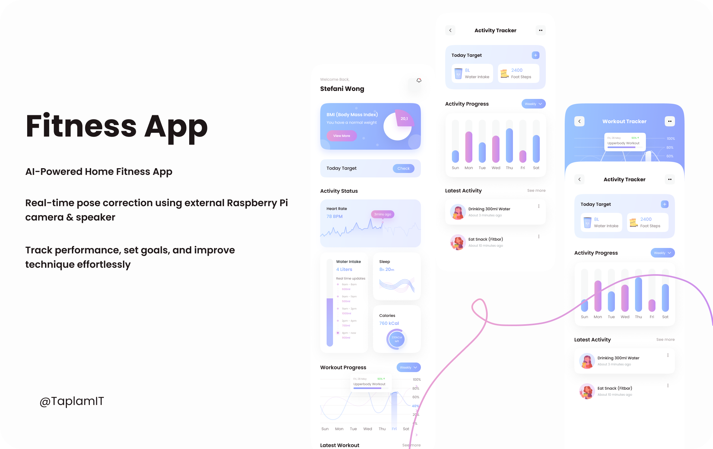
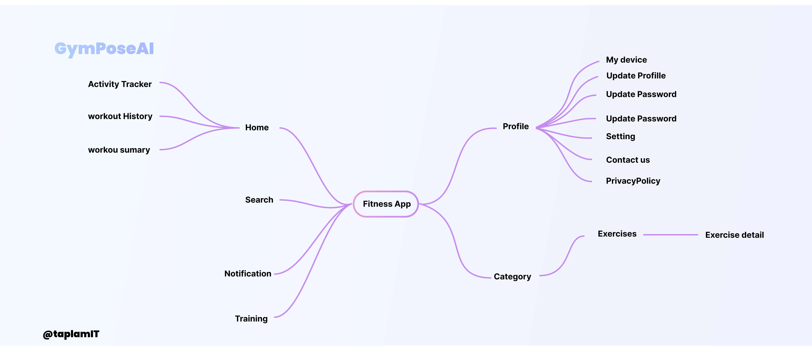

# 📱 GymPoseAI – Mobile App

🌐 Official React Native (Expo) mobile app for **GymPoseAI** — a smart AI-powered home workout assistant providing real-time posture analysis using an external device (e.g. Raspberry Pi).

## 

## ✨ Key Features

- 🤖 **Real-time Posture Feedback** with external AI camera (via WebRTC)
- 🔗 **BLE Device Discovery**: connect to IoT device and store its IP
- 📲 **WebRTC Streaming**: capture and stream video from external device
- 📊 **Workout History & Analytics**
- 📊 **Progress Charts**: weekly, monthly, yearly
- 🎯 **Training Goals & Reminders**
- 🔔 **Push Notifications** with Firebase Cloud Messaging (FCM)
- 🔐 **Secure OAuth 2.0 Login** (Facebook supported)

---

## ⚡ Tech Stack

| Feature           | Technology                  |
| ----------------- | --------------------------- |
| Language          | TypeScript / JavaScript     |
| Framework         | React Native + Expo SDK     |
| State Management  | React Context + React Query |
| Local Storage     | AsyncStorage                |
| API Communication | Axios + WebSocket           |
| BLE Communication | react-native-ble-plx        |
| Video Streaming   | WebRTC                      |
| Notifications     | Firebase Cloud Messaging    |

---

## 🛠️ Getting Started

### 1. Clone the Repository

```bash
git clone https://github.com/Dangtruong-DUT/GymPoseAI-
cd gymposeAI/mobile
```

### 2. Install Dependencies

```bash
npm install
```

### 3. Run the App

```bash
npm run dev --clear
```

### 4. Build with EAS

```bash
eas build --profile development --platform android
```

---

## ⚠️ Platform Limitation

> **Currently supported**: Android only.

iOS support pending due to:

- Camera permission constraints
- Facebook SDK limitations
- WebRTC compatibility issues

---

## 🚀 App + IoT Device Architecture

**GymPoseAI** uses an external device (e.g. Raspberry Pi) with camera and speaker to handle AI posture analysis.

### 🔄 Flow Overview

1. **Mobile App ↔ BLE**

    - Scans and connects to nearby IoT device
    - Retrieves and stores IP address via BLE advertisement

2. **Mobile App ↔ WebSocket Server**

    - Sends training session metadata
    - Receives posture feedback from AI

3. **IoT Device ↔ AI Engine via WebRTC**

    - Captures video and streams to AI server
    - AI analyzes poses and returns feedback


---

## 📷 Screens & Navigation

Include previews of core screens and navigation flow here.



---

## 🧑‍💻 Contributing

Pull requests welcome! For large changes, please open an issue first to discuss.

Report bugs or feature requests here: [GitHub Issues](https://github.com/Dangtruong-DUT/GymPoseAI-)

---

## 📄 License

MIT License — use freely with attribution.
